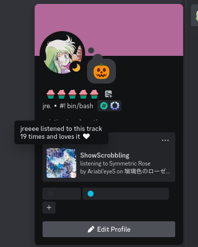
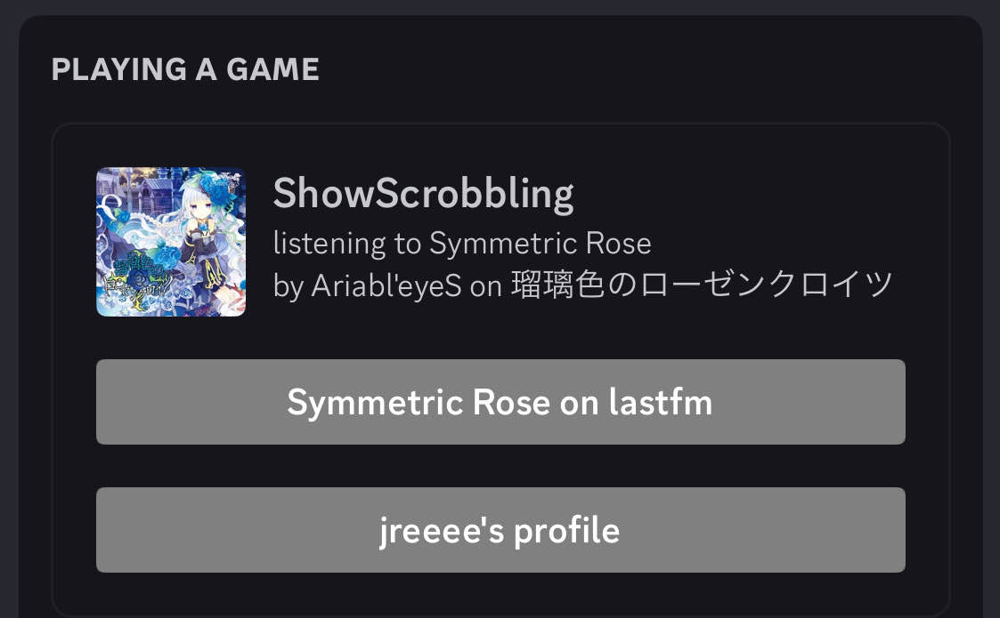

# ShowScrobbling
[](https://github.com/qwertyquerty/pypresence)
[](https://github.com/psf/black)

showscrobbling is an inofficial discord rich presence lastfm scrobble displaying app written in python.

it checks your lastfm profile for a currently playing track and displays it on discord.

showscrobbling aims to be simple, lightweight, cross-platform and easy to adapt to fit your needs (if you know a bit of python that is)

just start the program, enter your lastfm username and it should automatically connect to discord and show which song you are currently listening to. it updates every 30s to fetch the currently playing song

because of python, you can use this on Windows and Linux (probably also Mac) and with any scrobbler as long as it updates your lastfm page somewhat regularly.

 

when hovering over the icon the playcount is displayed. if the user has the track set as 'loved' this will also be shown here.

when another discord user clicks on your activity, tey'll have two buttons, linking to the song page on lastfm and your profile respectively.

i'm currently in the process of tidying this up a bit, right now i use the following
```
# python -m black showscrobbling.py && pylint showscrobbling.py
```

## requirements

- python3
- urllib*
- pypresence*

*also present in the ```requirements.txt```

(also your lastfm username and a working internet connection)

## usage

args | default | desc
--- | :---: | ---
-h \| --help | - | displays help message, listing all args
-u \| --user | - | your lastfm username 
-l \| --loglevel | 1 | program generated output, 0: silent -> 3: debug, default 1
-i \| --image | [this](https://media.tenor.com/Hro804BGJaQAAAAj/miku-headbang.gif) | default image link if there's none for the track
-c \| --cycle | 10 | used to calculate track length if not found*
-r \| --request | 30 | interval in seconds to request the lastfm api for most recent track

*currently the api is queried every 30 seconds, since some scrobblers do not correctly transmit when tracks are paused, i decided to implement a very rudimentary cycle approach, that checks how long track are and then gets a cycle count from that. so for a 4 minute track we'd get 9 cycles (8 + 1 "bonus") based off of the request frequency. every request the cycle is decreased. if we land at 0 the song is playing longer than it should and thus has likely been paused. in that case the app sleeps and clears the rpc picture, waking up when a new song is scrobbled. since not all songs have a set length on lastfm there are instances where the app has to "guess" a length. for now this value is set to 10, so roughly a 5 to 5.5 min track, after which the program will 'sleep'.