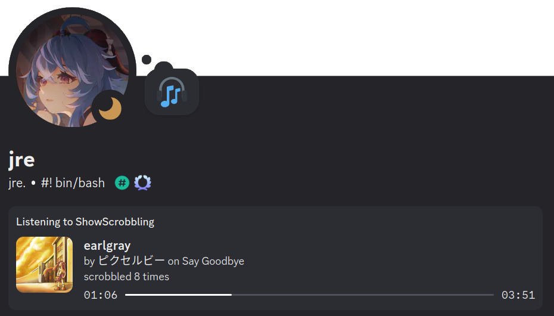

# **|**|:S:|**|** - ShowScrobbling
 

### description

showscrobbling / shoscro / **|**|:S:|**|** is an inofficial discord rich presence last.fm scrobble displaying script written in python.

it checks your last.fm profile for a currently playing track and displays it on discord.

    

### goal

showscrobbling aims to be simple to use, lightweight and cross-platform

### why?

i usually listen to music via youtube using [Web Scrobbler](https://web-scrobbler.com/), or local music players like rhythmbox. this means that i don't have a cool discord rpc to show off my _amazing_ music taste like those spotify peeps, which i wanted to change. there are a couple of similar projects out there, see the [similar projects list](#similar-projects), but they weren't as straightforward / easy to use as i wanted, so i made my own.

### setup
#### commandline:
`# git clone https://github.com/jreeee/showscrobbling`

`# cd showscrobbling  && ./setup.py`

`# pip install -r requirements.txt` (or use your packet manager to install the [reqs](#requirements))
#### graphical:
download the repo/[latest release](https://github.com/jreeee/ShowScrobbling/releases/latest) and unzip it.
before starting the programm please execute the `setup.py` file and enter your username when prompted.
this will create a file called `constats.py` in the `framework` folder where various static values reside. you'll also need to install the [required libraries](#requirements) for shoscro to work

### troubleshooting
should error occur after upgrading to a new version, run `./setup.py` again and, when prompted, type 'u' to update the `constants.py`. this will update the file, keeping the set values you already set.

### startup

after finishing the setup just start the program. it should automatically connect to discord and show which song you are currently listening to. it then updates every 30s to fetch the currently playing song from last.fm.

### general info

because shoscro is written in python, you can use this on Windows and Linux (probably also Mac) and with any scrobbler as long as it updates your lastfm page somewhat regularly.

    

when another discord user clicks on your activity, they'll have two buttons, linking to the song page on lastfm and your profile respectively.

the **|**|:S:|**|** logo is inspired by music notation, in full it would techically be somehting like **|**|: S | $^{1}$ how :|**|** $^{2}$ crobbling | originally i wanted to incorporate imagery linked to music and the two S' into the logo directly, tho as the latter is generally best avoided, i leaned into the music notation a bit more, using the repetition symbol to imply two S' while just showing one. The Text-Logo uses (bold) pipe symbols and double points to recreate the repeat symbols, `**|**|:S:|**|**`  in markdown. i prefer this over the unicode symbols.

### caching
showscrobbling uses caching to locally store track metadata. by default data is stored in `~/.cache/showscrobbling/metadata.json`. you can change this folder in the `constants.py` or using [arguments](#usage) to wherever you have r/w permissions. just make sure to add the tilde at the start for paths relative to your user or stick to absolute paths, otherwise python won't resolve the path correctly and the script won't work.

### development

for linting and formatting the code, the `setup.py` provides a prompt to create a pre-commit hook. this uses `black` for formatting and `pylint` for linting. currently only the formatting has to pass for the commit to be valid and i use pylint more as reference.

## requirements

- python 3.9 or newer
- urllib $^{1}$
- pypresence $^{1,2}$
- (lynxpresence $^{2}$)

$^{1}$ also present in the `requirements.txt`

$^{2}$ to show _listening_ instead of _playing_ in discord you'll need the [git version](https://github.com/qwertyquerty/) of pypresence or [lynxpresence](https://github.com/C0rn3j/lynxpresence), an updated fork of pypresence. as this is more of a temporary measure until pypresence gets a new release out, i have not put it into the requirements (yet).

(also discord, your lastfm username and a working internet connection)

## arguments

args | default | desc
--- | :---: | ---
-h \| --help | - | displays help message, listing all args
-u \| --user | - | your lastfm username 
-l \| --loglevel | 1 | program generated output, 0: silent -> 4: debug, default 1
-i \| --image | [this](https://media.tenor.com/Hro804BGJaQAAAAj/miku-headbang.gif) | default image link if there's none for the track
-r \| --request | 30 | interval in seconds to request the lastfm api for most recent track
-c \| --cache-path | - | abolute path were showscrobbling reads data from and writes data to, e.g. `"~/git/showscrobbling/cache/metadata.json"`
-E \| --enable-lfm-track-image | - | enable the use of the lfm track image. this is different from the lfm album image in that it is just a grey star sometimes ([see issue #15](https://github.com/jreeee/ShowScrobbling/issues/15)). because of that, showscrobbling elects to ignore this imagelink by default
-C \| --check-cache | - | info about the cached songs

## similar projects
- Gust4Oliveira's [Last.fm Discord Rich Presence](https://github.com/Gust4Oliveira/Last.fm-Discord-Rich-Presence)
- gahtv's [Last.fm-Discord-RPC](https://github.com/gahtv/Last.fm-Discord-RPC)
- dimden's [LastFMRichPresence](https://github.com/dimdenGD/LastFMRichPresence)
- androidWG's [Discord.fm](https://github.com/androidWG/Discord.fm)